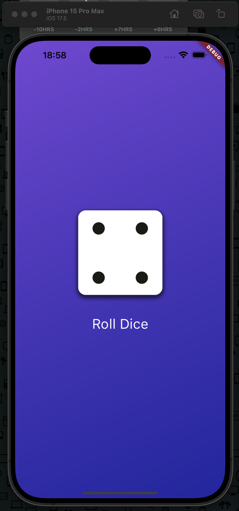

# Flutter Dice Application

This README provides a comprehensive guide to this Flutter project, covering everything from project setup to detailed explanations of Dart's core concepts. The application demonstrates a simple dice roller implemented in Dart(Flutter), allowing a user to roll the dice using a button and having the dice face change randomly.

## Table of Contents

- [Flutter Dice Application](#flutter-dice-application)
  - [Table of Contents](#table-of-contents)
  - [Project Setup](#project-setup)
  - [Understanding `main.dart`](#understanding-maindart)
  - [Function Definitions and Uses](#function-definitions-and-uses)
  - [Widgets in Flutter](#widgets-in-flutter)
  - [Object-Oriented Programming in Dart](#object-oriented-programming-in-dart)
  - [Data Type Safety](#data-type-safety)
  - [State Management](#state-management)
  - [Dependency Management](#dependency-management)
  - [Optimizing Performance](#optimizing-performance)
  - [Running the Application](#running-the-application)
  - [Application Screenshot](#application-screenshot)

## Project Setup

To scaffold a new Flutter iOS project, follow these steps:

1. Ensure you have Flutter installed on your system.
2. Open your terminal and run `flutter create project_name`.
3. Navigate into your project directory with `cd project_name`.
4. To focus on iOS, you can run `flutter run -d ios` to initiate the build for iOS devices or simulators.

## Understanding `main.dart`

The `main.dart` file is the entry point of a Flutter application. It contains the `main` function, which executes automatically when the app starts. The `runApp()` function within `main` tells Flutter what to display on the screen, initiating the widget tree—a hierarchy of nested Flutter widgets that make up the user interface.

## Function Definitions and Uses

Functions in Dart can be both built-in and custom-defined. They are essential for executing specific tasks and can return values. Functions enhance code reusability and organization.

## Widgets in Flutter

Flutter provides a rich set of built-in widgets and allows the creation of custom widgets. Widgets are the basic building blocks of a Flutter app's user interface, with two main types:

- **Stateless Widgets**: Widgets that do not maintain state changes.
- **Stateful Widgets**: Widgets that can dynamically change their state during runtime.

## Object-Oriented Programming in Dart

Dart is an object-oriented programming language, emphasizing objects as the primary way to represent and manage data. This approach facilitates more structured and scalable code.

## Data Type Safety

Dart enforces type safety, ensuring variables hold specific types of data. This reduces errors and improves code quality.

## State Management

Understanding the difference between stateless and stateful widgets is crucial for managing the app's state efficiently.

## Dependency Management

The `pubspec.yaml` file is used to manage project dependencies. You can add new dependencies under the `dependencies` section to extend the functionality of your Flutter application.

## Optimizing Performance

Using `const` for widgets that do not change can significantly optimize performance. The Dart extension in VS Code assists in identifying such opportunities for optimization.

## Running the Application

To run the Flutter application, follow these steps:

1. Open a terminal in the project directory.
2. Execute `flutter run` to build and run the app on an available emulator or connected device.

## Application Screenshot

Below is a screenshot of the application, showcasing its UI and functionality:

---

Official [Flutter documentation](https://flutter.dev/docs).
